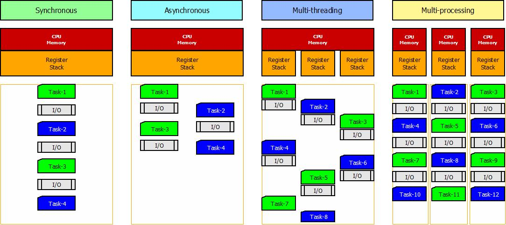

# Concurrency in Python

> The repository provides a comprehensive guide with examples on how to achieve concurrent code execution in Python including many technics/library such as **Asyncio**, **threading** or **multiprocessing**.<br>
> I will show the advantages and backwards of each option and representing them with reusable code examples.   

---
### Table of Contents

- [Concurrency](#concurrency)
- [Sync vs Async vs Multithread vs Multiprocess](#sync-vs-async-vs-multithread-vs-multiprocess)
- [Comparison of concurrent programming types](#comparison-of-concurrent-programming-types)
- [Task to work with concurrent programming](#task-to-present-the-difference-of-each-execution-type)
  - [Importance of prime numbers](#importance-of-prime-numbers) 
  - [Checking Prime Numbers](#checking-prime-numbers)
- [Multitasking to find prime numbers](#multitasking-to-find-prime-numbers)
  - [Synchronous execution](#1st-approach-synchronous-execution)
  - [Cooperative execution](#2nd-approach-co-operative-execution)
  - [Asynchronous execution](#3rd-approach-asynchronous-execution)
  - [Multithreading execution](#4th-approach-multi-thread-execution)
  - [Multiprocessing execution](#5th-approach-multiprocess-execution)
  - [Comparing the best approaches](#comparison-of-the-3-best-approach)
  - [Final result](#final-result)
---

## Concurrency

In modern computer programming, concurrency is often required to accelerate solving a problem. <br>
"In computer science, **concurrency** is the ability of different parts or units of a program, algorithm, or problem to be executed out-of-order or in partial order, without affecting the outcome." *(Wiki: Concurrency (computer science)<sup>1</sup>)*

Parallel execution is a way to achieve this but this is not the only way. On the other hand, since Python is a single-threaded programming language, this is not always easy to do in some cases due to the [GIL<sup>2</sup>](#resources).<br>
"**Parallel computing** is a type of computation in which many calculations or processes are carried out simultaneously. Large problems can often be divided into smaller ones, which can then be solved at the same time." *(Wiki: Parallel computing<sup>3</sup>)* 

But before we dive deep into this topic, let's look at two more concepts to understand the solutions to this problem.

### CPU-Bound VS I/O-Bound

The problems that our modern computers are trying to solve can be categorized into CPU-bound or I/O-bound, we can think about it as CPU heavy or I/O (input/output) heavy operations.
Whether the problem is CPU-bound or I/O-bound affects our selection from the concurrency libraries multiprocessing, threading, and asyncio.

The concept of CPU-bound and I/O-bound are universal for all programming languages.
- **CPU-bound**: refers to a condition when the time for complete the task is determined by the speed of the central processor. 
The faster clock-rate CPU can do faster calculation that results in execution with higher performance.
- **I/O-bound**: refers to a condition when the time to complete a computation is determined by the period spent waiting for some I/O (input/output) operations to be completed. 
Increasing CPU clock-rate or number of CPUs will not increase the performance. I/O operations are reading/writing to hard drive or waiting for network delay (API request, DB operation, etc.).

> ### **Let's see what the difference between all of them.**

---

## Sync vs Async vs Multithread vs Multiprocess


- **CPU**: A central processing unit (CPU) that executes instructions of a computer program. In this context we need to think about it as a CPU core, since in modern computers we use multicore processors, because each core can read and execute program instructions independently.  
- **Memory**: Memory is also an important part in concurrency because parallely running task can influence each other if they are working on the same data in the memory. 
- **Register**: A stack register is a computer central processor register whose purpose is to keep track of a call stack, used to store information about the memory segment that stores the call stack of currently executed program.
- **Stack**: In computer science, a call stack is a stack data structure that stores information about the active subroutines/functions of a computer program. This type of stack is also known as an execution stack, program stack, control stack, run-time stack, or machine stack, and is often shortened to simply "the stack".  

### Synchronous execution

In synchronous execution, each line of code or task is executed one after the other, and the program waits for each operation to complete before moving on to the next one.<br>
I/O bounded operations are blocking the execution, so we need to wait for them to complete before we can continue our code execution.<br>
- Tasks are executed on the same CPU/CPU core
- Working with the same data on same heap memory
- Using the same register and stack
- Task executions are blocking the upcoming tasks.

### Asynchronous execution

Asynchronous is a non-blocking architecture. With async programming, multiple related operations can run concurrently without waiting for other tasks to complete or blocking further execution.<br>
Async code often relies on callbacks, promises/futures, or async-await syntax to handle the flow and dependencies between different tasks.<br>
- Tasks are executed on the same CPU/CPU core
- Working with the same data on same heap memory
- Using the same register and stack
- Tasks are executed concurrently and not blocking the upcoming tasks. It is useful when we need to do some I/O operations also, and we can utilize the CPU during the waiting period of that I/O operation.

**Python uses the built-in [`asyncio`<sup>4</sup>](#resources) package to provide these capabilities.**

> **In short about Asyncio**
>
> - We use Async/await syntax, async to indicate our async functions and await for blocks where we want to wait for the outcome.
> - Asyncio uses 'event-loop' as the core of every async application, we can get it by the `.get_event_loop()` function or just call the top-level entry point function in the `.run()` function's parameter list.
> - Coroutines are declared with the async keyword, we can run one coroutine with the `run` function or create multiple task with coroutines by using the `create_task` function.
> - We say that an object is an `awaitable object` if it can be used in an await expression. There are three main types of awaitable objects: **coroutines**, **Tasks**, and **Futures**.
> - We can collect the result from multiple awaitables wit the `.gather()` function.
> - We can also wait for Futures and Task to complete by using the `.wait()` function. It accepts a collection of awaitables (list, dict or set) and an optional timeout which specify the maximum waiting time. It returns two sets of Tasks/Futures: (done, pending).
> - Task groups combine a task creation API with a convenient and reliable way to wait for all tasks in the group to finish. TaskGroup uses context manager to provide a concise and elegant way to create multiple tasks.
>
> There are other async related libs in python such as: `aiofiles` or `aiohttp`.

### Multithreaded execution

Multithreading gives the illusion of running tasks in parallel. In reality, the processor is switching between the tasks by using a scheduling algorithm.<br>
Other languages may work truly parallel on a multicore processor machine, but with Python it won't be real parallelism because of the built-in GIL or `Global Interpreter Lock`.<br>
- Tasks are executed on the same CPU/CPU core
- Working with the same data on same heap memory
- Using different register and stack for each tread.
- Tasks are managed and executed in parallel, as if it were real parallel execution. We can feel the difference when we work with tasks that contain a lot of I/O operations.

**Python uses the built-in [`threading`<sup>5</sup>](#resources) package to provide these capabilities.**

> **In short about Multithreading in Python**
>
> - The `Thread` class represents an activity that is run in a separate thread of control. There are two ways to specify this: by passing a callable object to the constructor, or by overriding the run() method in a subclass.
> - You can create a new thread with the constructor by specifying the *name* (name of the thread), *target* (a callable whis is the entry point of the new thread), *args/kwargs* (parameters), *daemon* (if it's a daemon thread or normal)
> - The created threads will not start automatically like tasks in asyncio, they need to be start and await with the `start()` and `join()` functions.
> - Using the `ThreadPoolExecutor` from `concurrent.futures` is a simple way to create and manage multiple threads in our application.
> - There are multiple ways to deal with [race conditions<sup>6</sup>](#resources).
>   - **Lock** (or mutex) can be acquired to avoid that a resource is modified by multiple threads or processes at the same time. Create with `threading.Lock()` and then acquire() to lock and release() when finished the modification.
>   - (Bounded)**Semaphore** is a counter that can limit the number of threads/processes to access a resource.
>   - **Timer**(sec: float) can schedule a function to be called after a certain amount of time.
>   - **Barrier**(n) can keep a fixed number of threads in sync. Each thread calls .wait() on the Barrier, and after they all will remain blocked until the specified number of threads are arriving that point. Finally, they are all released at the same time.<br>
>   *This can be used for many purposes: (1) allows a pool of threads to initialize themselves before they start to work, (2) waiting for the results of the different threads because it is required before proceeding, (3) limiting network calls to buckets to avoid overloading the remote server, etc.*
> 
> (i) More about Threading in Python: [Python Threading: The Complete Guide (superfastpython.com)](https://superfastpython.com/threading-in-python/)


### Multiprocessing execution

Multiprocessing refers to the ability of a system to run multiple processors in parallel and perform different tasks at the same time. In Python, this is possible by using the `multiprocessing` package to create and run several `Processes`.<br>
This means that in the background we create new processes from the main process, which have a separate Python interpreter, heap memory and GIL.<br> 
- Tasks are executed on different CPU/CPU core
- Working with different data and not doesn't share memory (different heap space)
- Using different register and stack for each process (different PID).
- Tasks are managed and executed truly parallel. We can utilize the multicore processors capability to increase our computation power.

**Python uses the built-in [`multiprocessing`<sup>7</sup>](#resources) package to provide these capabilities.**

---

> (!) In Python 3.2 was introduced the `concurrent.futures` module that provides a high-level interface for asynchronously executing callables and supporting the work with threads and processes.<br>
> `Executor` object, `ThreadPoolExecutor`, `ProcessPoolExecutor`, `Future` objects, etc.
> 
> [More about the 'concurrent.futures' in Python docs](https://docs.python.org/3/library/concurrent.futures.html)

## Comparison of concurrent programming types

|                                   | **Synchronous programming**                                      | **Asynchronous programming**                                                                               | **Multithreading programming**                                                                                                       | **Multiprocessing programming**                                                                                                |
|-----------------------------------|------------------------------------------------------------------|------------------------------------------------------------------------------------------------------------|--------------------------------------------------------------------------------------------------------------------------------------|--------------------------------------------------------------------------------------------------------------------------------|
| **Execution flow**                | Sequential                                                       | Concurrent                                                                                                 | Concurrent                                                                                                                           | Parallel                                                                                                                       |
| **Blocking operations**           | Blocks on I/O                                                    | Non-blocking I/O                                                                                           | Non-blocking I/O                                                                                                                     | Non-blocking                                                                                                                   |
| **Thread usage**                  | Single thread                                                    | Single thread                                                                                              | Multiple threads                                                                                                                     | Multiple processes                                                                                                             |
| **Concurrency model**             | None                                                             | Cooperative Multitasking                                                                                   | Illusion of parallelism                                                                                                              | True parallelism                                                                                                               |
| **Context switching<br>overhead** | No                                                               | Low                                                                                                        | Medium                                                                                                                               | High                                                                                                                           |
| **State/Memory**                  | Not relevant                                                     | Shared memory                                                                                              | Shared memory                                                                                                                        | Separate process memory                                                                                                        |
| **Synchronization**               | Not relevant                                                     | Async/await, events                                                                                        | Lock, semaphore, etc.                                                                                                                | Inter-process communication (IPC) techniques like pipes, message queues                                                        |
| **Disadvantages**                 | - Non-concurrent<br>- Blocks on I/O                              | - No real parallelism, <br>- All yours code and dependent codes forced to use asyncio                      | - No real parallelism<br>- Additional complexity to create thread safe code                                                          | - Time and resource consuming the process creation<br>- Additional complexity because of synchronization                       | 
| **Use cases**                     | For simple processing without heavy CPU or I/O bound operations. | For network applications like web servers, databases etc. where blocking I/O operations limit performance. | When you need to run I/O bound or CPU bound jobs concurrently in a single process and you want to avoid to make all your code async. | For CPU bound jobs that require truly parallel execution across multiple cores: multimedia processing, scientific computations |

---

## Task to present the difference of each execution type

> **A prime number (or a prime) is a natural number greater than 1 that is not a product of two smaller natural numbers.**
> 
> In simple terms, Prime numbers are natural or whole numbers, divisible only by **one** and the number itself.

### Importance of Prime Numbers

**Characteristics of Prime Numbers**

- The whole number line consists of prime numbers
- You can produce a whole number line just by prime numbers. For example, you can write 12 as 2 * 2 * 3, and all these numbers are prime
- A mathematical proof has shown that any group of prime numbers can be multiplied to produce any number
- Modern computer cryptography works on the prime factors of large numbers
- Primes are crucial as they act as the building blocks of whole numbers 
- Primes’ odd mathematical characteristics make them very useful 

**Real life situation where we use/apply Prime Numbers**

- We constantly use and rely on prime numbers for cyber-age security
- Primes’ odd mathematical property is used in encryption and decryption
- They are used in generating error-correcting codes used in telecommunications. They ensure that message is sent and received with automatic correction
- Primes act as the base for creating the public-key cryptography algorithms
- They are used for hash tables or for generating pseudorandom numbers
- ...and many more.

### Checking Prime Numbers

**We have a method to check if a number is prime number.**

*[multi_tasking/helper/primes.py:8](multi_tasking/helper/primes.py?plain=8)*
```python
def is_prime(n: int):
    if n in [2, 3]:
        return True
    elif n <= 1 or n % 2 == 0:
        return False
    else:
        factors = range(3, int(math.sqrt(n)) + 1, 2)
        for i in factors:
            if n % i == 0:
                return False
        return True
```

> Let's use it and find some prime numbers.<br><br>
> By running the mentioned python module/file (`multi_tasking/helper/primes.py`), we can see the result of checking the first 10 million numbers to see which are the prime numbers.<br>
> The result shows that there are **664_579** prime numbers up to 10_000_000, and also shows some special kind of primes numbers. *Just for fun* :)<br>
> *(twin primes, cousin primes, sexy primes, permutable/anagrammatic prime, prime triplets)*
> On my computer, calculating the mentioned prime numbers took a little bit more than half minutes, *31.021 sec*. <br>
> 
> But what if I want to calculate much more primes?
> It takes much more time, or...<br>
> 
>> ### **Let's do some coding, and see what we can do to accelerate this process.**

---

---

## Multitasking to find prime numbers

**So let's create a proper solution that helps us find prime numbers using multitasking (concurrency).**

To make our solutions more comparable and write fewer lines of codes we start with some abstraction and helper functions:
- `multi_tasking/helper/primes.py` provides the prime checking function.
- `multi_tasking/helper/prime_helper.py` contains a wrapper function and two decorators, `@time_it` measures the execution times and `@c_profiler` provides detailed profiling information to measure the execution time and the number of call of each function in the code.
- `multi_tasking/model/` folder provides some abstraction with a `TaskRunner` and a `Worker` class to help building up different multitasking solutions.

> (!) To easily compare a bunch of solutions we calculate the primes only for the first 1000 numbers, but add a small delay (0.05 sec) for each calculation to pretend that we have some more complex calculation.

All solutions, in most of the cases, start with creating a queue and fill it with numbers from 1 to 1000, extend and instantiate the TaskRunner, and then start the processing by calling its execute method.   

---

### 1st approach: Synchronous execution

> `multi_tasking/sync.py` - **SyncTaskRunner**

In the first try, *just to be able to compare our solutions*, will use a basic solution come from the default Worker.

#### Steps of the solution

- The [**SyncTaskRunner**](multi_tasking/i_synchronous.py?plain=8) create a group of worker and process the number from the common Queue.
- A worker start a while loop, and process the number until the Queue will be empty

#### Result

- Execution time: `50.5522 sec`
- Execution result: `{'Worker-1': {2, 3, 5, 7, ...}, 'Worker-2': set()}` => Only one worker did the processing!
- Workers PID: same for each worker.
- Since the execution is synchronous, even if we have 2 workers the second one cannot run until the first one finish its job. 
- We have 2 workers but only one does the processing. (*See: Execution result*)

---

### 2nd approach: Co-operative execution

#### Steps of the solution

- The [**CoopTaskRunner**](multi_tasking/ii_cooperative.py?plain=25) is created with adding a custom worker (CoopWorker) and task-runner implementation.
- The `CoopWorker.process` function set the Worker status to `Busy` before the processing and set it to `Idle` when finishes.
- The `TaskRunner.__select_idle_worker` function iterate through the workers and find an idle worker.
- The Taskrunner get an item from the Queue and then delegate the task to the selected idle worker.
  

#### Result

- Execution time: `51.1277 sec`
- Execution result: `{'Worker-1': {2, 3, 5, 7, ...}, 'Worker-2': set()}` => Still one worker did the processing!
- Workers PID: same for each worker.
- We have a method to get an idle worker to process a task, but the execution is still synchronous so the first idle worker will always the first worker. 
- We have 2 workers but only the first one does the processing again. (*See: Execution result*)
- Note: We could randomize the worker selection, but it wouldn't help to parallelize the execution, only distribute the task between the workers without any concurrent processing. 

---

### 3rd approach: Asynchronous execution

#### Steps of the solution

- The [**AsyncTaskRunner**](multi_tasking/iii_asynchronous.py?plain=33) is created with adding a custom worker ([AsyncWorker](multi_tasking/iii_asynchronous.py?plain=17)), a RunnerType to select different execution modes, and the task-runner implementation.
- The `AsyncWorker.process` function works as the default Worker but uses `asyncio.sleep` instead of `time.sleep`.
- The `AsyncRunnerType` differentiate two running mode: `SIMPLE`, for manual task management; and `TASK_GROUP`, for task management with asyncio.TaskGroup. 
- The `TaskRunner.__select_idle_worker` function iterate through the workers and find an idle worker.
- The Workers get the items from the common Queue to process them.

#### Result

**Execution times and results**

| Runner Type | Num. of Workers | Execution time        | Execution result                                                                      | Note                                                                                       |
|:-----------:|:---------------:|-----------------------|---------------------------------------------------------------------------------------|--------------------------------------------------------------------------------------------|
| SIMPLE      | 2               | 32.1810 sec           | `Worker-1: {3, 5, 7, ...}` `Worker-2: set(2)`                                         | 2 workers did the processing, but the second one apparently only worked with even numbers! |
| SIMPLE      | 3               | 21.0620 sec           | `Worker-1: {7, 13, 19, ...}` `Worker-2: {2, 5, 11, ...}` `Worker-3: {3, 53, 59, ...}` | 3 workers did the processing!                                                              |
| TASK_GROUP  | 3               | **BEST: 20.9242 sec** | `Worker-1: {7, 13, 19, ...}` `Worker-2: {2, 5, 11, ...}` `Worker-3: {3}`              | 3 workers did the processing!                                                              |  

- Workers PID: same for each worker.
- The first apparently working solution that helps with concurrent task execution. All workers do some computation. 

---

### 4th approach: Multi-thread execution

#### Steps of the solution

- The [**MultiThreadTaskRunner**](multi_tasking/iv_multi_threading.py?plain=50) is created with adding a custom worker ([MultiThreadWorker](multi_tasking/iv_multi_threading.py?plain=21)), a RunnerType to select different execution modes, and the task-runner implementation.
- The `MultiThreadWorker` has 3 methods to execute the task: (1) the default inherited *process* function, (2) *processing_with_lock*, which uses a lock mechanism to avoid race conditions (3) *pool_processing* which is used in ThreadPoolExecutor.
- The `MultiThreadRunnerType` differentiate three running mode: `SIMPLE`, uses the default *process* method; `LOCKED_LIST`, uses the *processing_with_lock* method; and `THREAD_POOL`  uses the *pool_processing* method.
- The Workers get the items from the common Queue to process them.


#### Result

**Execution times and results**

| Runner Type | Num. of Workers | Execution time        | Execution result                                                                                                                                               | Note                                                                                      |
|:-----------:|:---------------:|-----------------------|----------------------------------------------------------------------------------------------------------------------------------------------------------------|-------------------------------------------------------------------------------------------|
| SIMPLE      | 2               | 25.2479 sec           | `Worker-1: (5, 7, 11, ...)`, `Worker-2: (2, 3, 23, ...)`                                                                                                       | 2 workers did the processing!                                                             |
| LOCKED_LIST | 2               | 25.2679 sec           | `Worker-1: (2, 3, 5, ...)`, `Worker-2: (7, 17, 19, ...)`                                                                                                       | 2 workers did the processing!                                                             |
| THREAD_POOL | 2               | 25.2255 sec           | `Worker_0: (2, 3, 5, ...)` `Worker_1: (503, 509, 521, ...)`                                                                                                    | 2 workers did the processing on different chunks extracted from the full list of numbers! |
| THREAD_POOL | 3               | **BEST: 16.8516 sec** | `Worker_0: (2, 3, 5, ...)` `Worker_1: (337, 347, 349, ...)` `Worker_2: (673, 677, 683, ...)`                                                                   | 3 workers did the processing on different chunks extracted from the full list of numbers! |
| THREAD_POOL | 5               | 10.0864 sec           | `Worker_0: (2, 3, 5, ...)` `Worker_1: (211, 223, 227, ...)` `Worker_2: (401, 409, 419, ...)` `Worker_3: (601, 607, 613, ...)` `Worker_4: (809, 811, 821, ...)` | 5 workers did the processing on different chunks extracted from the full list of numbers! |

- Workers PID: same for each worker.
- Using threads we could make cleaner code which also perform a bit better than the async alternative. All workers do some computation.

---

### 5th approach: Multiprocess execution

#### Steps of the solution

- The [**MultiProcessTaskRunner**](multi_tasking/v_multi_processing.py?plain=35) is created with adding a custom worker (MultiProcessWorker), a RunnerType to select different execution modes, and the task-runner implementation.
- The `MultiProcessWorker` has 3 methods to execute the task: (1, 3) the *process* and *process_with_chunks* functions works on a chunk that extracted from the full list of numbers and uses a manager dict to store the results or directly return the result. (2) The *process_with_shared_resource*, is the modified version of the default 'process' function which uses common queue, but upgraded for multiprocess execution.
- The `MultiProcessTaskRunner` differentiate four running mode:
  - `SIMPLE`, create chunks of data and uses the default *process* method.
  - `SHARED`, uses Manager object to share the common queue and the common result dictionary, and uses a group of workers with their *process_with_shared_resource* function.
  - `PROCESS_POOL` also uses the Manager object but with a ProcessPoolExecutor that managing the processes which also runs the *process_with_shared_resource* function.
  - `CHUNKS_IN_POOL` is a hybrid solution that create chunks of data but the task execution is managed by a ProcessPoolExecutor.
- The printed PID (process identifier) of the workers clearly shows that we use different processes to complete the task. At this point we reach the goal of true parallelism.

#### Result

**Execution times and results**

|  Runner Type   | Num. of Workers | Execution time        | Execution result                                                                                                                                                                               | Note                                                                                      |
|:--------------:|:---------------:|-----------------------|------------------------------------------------------------------------------------------------------------------------------------------------------------------------------------------------|-------------------------------------------------------------------------------------------|
|     SIMPLE     |        3        | **BEST: 17.1390 sec** | `Worker-1: (2, 3, 5, ...)` `Worker-2: (337, 347, 349, ...)` `Worker-3: (673, 677, 683, ...)`                                                                                                   | 3 workers did the processing on different chunks extracted from the full list of numbers! |
|     SIMPLE     |       10        | 5.4353 sec            | `Worker-1: (2, 3, 5, ...)` `Worker-2: (101, 103, 107, ...)` `Worker-3: (211, 223, 227, ...)` `Worker-4: (307, 311, 313, ...)` `Worker-5: (401, 409, 419, ...)` ...                             | 3 workers did the processing on different chunks extracted from the full list of numbers! |
|     SHARED     |        3        | 17.4743 sec           | `Worker-1: (2, 3, 19, ...)` `Worker-2: (5, 7, 11, ...)`                                                                                                                                        | 3 workers did the processing from the common queue!                                       |
|  PROCESS_POOL  |        3        | 17.3709 sec           | `SpawnProcess-20: (3, 37, 41, ...)` `SpawnProcess-21: (2, 5, 17, ...)` `SpawnProcess-22: (7, 11, 13, ...)`                                                                                     | 3 workers did the processing from the common queue!                                       |
|  PROCESS_POOL  |        5        | 10.6335 sec           | `SpawnProcess-24: (3, 13, 37, ...)` `SpawnProcess-25: (11, 31, 41, ...)` `SpawnProcess-26: (2, 7, 17, ...)` `SpawnProcess-27: (19, 29, 59, ...)` `SpawnProcess-28: (5, ...)`                   | 5 workers did the processing from the common queue!                                       |
|  PROCESS_POOL  |       10        | 5.7128 sec            | `SpawnProcess-31: (13, 41, 223, ...)` `SpawnProcess-32: (349, 379, 389, ...)` `SpawnProcess-33: (2, 19, 29, ...)` `SpawnProcess-34: (5, 23, 43, ...)` `SpawnProcess-35: (17, 37, 47, ...)` ... | 10 workers did the processing from the common queue!                                      |
| CHUNKS_IN_POOL |       10        | 5.5582 sec            | `Worker-1: (2, 3, 5, ...)` `Worker-2: (101, 103, 107, ...)` `Worker-3: (211, 227, 229, ...)` `Worker-4: (307, 311, 313, ...)` `Worker-5: (401, 419, 421, ...)` ...                             | 10 workers managed by pool did the processing on different chunks!                        |


- Workers PID: different for each worker. Real parallelism.
- Using processes we could make real parallelism which is good for computation heavy tasks but here we can see some performance decreases compare to threading.<br>
*The reason for the lack of performance increase is obviously not multiprocessing execution but the communication overhead between the processes to manage proper synchronization and data sharing across the workers.*

#### **But what is the best solution for this problem if we do not distort the result with any delay?**

---

## Comparison of the 3 best approach

> In our last code execution we compare the best 3 method to find out which one performs the best.
> 
> 1.) **AsyncTaskRunner** which uses the `asyncio` package and `TaskGroup` 
> 2.) **MultiThreadTaskRunner** which uses the `threading` package and `ThreadPoolExecutor` from *concurrent.futures*
> 3.) **MultiProcessTaskRunner** which uses the `multiprocessing` package and `ProcessPoolExecutor` from *concurrent.futures* with data chunking.

**Let's run our [`comparison` module](multi_tasking/vi_comparison.py).**
We compare these selected solution with different volume of data from 1 thousand to 100 million numbers and without the 0.05 second of forced delay what was injected into the workers.

### Result

| Calculation  upper limit | Num. of Workers | Asynchronous<br> Execution time | Multithreading<br> Execution time | Multiprocessing<br> Execution time |
|-------------------------:|:---------------:|:-------------------------------:|:---------------------------------:|:----------------------------------:|
|                  100 000 |        10       |          **0.3624 sec**         |             0.5326 sec            |             0.4711 sec             |
|                1 000 000 |        10       |            3.7752 sec           |             5.9180 sec            |           **1.3738 sec**           |
|               10 000 000 |        10       |           58.4305 sec           |            98.2302 sec            |           **21.7587 sec**          |
|               50 000 000 |        10       |   554.2766 sec<br> (9.23 min)   |    725.3965 sec<br> (12.08 min)   |   **182.7984 sec**<br> (3.04 min)  |
|              100 000 000 |        10       |  1138.4652 sec<br> (18.97 min)  |   1547.9455 sec<br> (25.79 min)   |   **492.9215 sec**<br> (8.21 min)  |

> **As we can clearly see, real parallelism helps us with CPU heavy calculations, but it is not profitable in the short run since creating new processes are time and resource consuming.**
> 
> One final step is left. We should avoid that complex abstraction that we used to create many different solutions, which add extra time to our computation and it's simply removable.

---

## Final result

**We can agree that the best solution is to go with multiprocessing, but there are some unnecessary codes that may reduce the performance of our solution.**

But if we extract the core of our code and run only the parts that really matter, we'll see what our code is capable of.

- By checking the `vii_final_test.py` module, and it's [calc_primes()](multi_tasking/vii_final_test.py?plain=29) function, we can see the extracted code is rewritten a little bit
  - We do not use any abstract classes from the previous version but only 2 simple function. The `calc_primes` manages the whole execution, and the `process_with_chunks` the exact processing. 
  - We do not use queue, list, or even tuple but passing an interval to the processes, and they work with a `range` object which definitely reduce the memory footprint and also the processing time

### Result

| Calculation upper limit | Num. of Workers | Original solution (synchronous) | Abstract solution (TaskRunner + Worker) | Upgraded solution (simple func - calc_primes()) | Performance boost |
|:-----------------------:|:---------------:|:-------------------------------:|:---------------------------------------:|:-----------------------------------------------:|:-----------------:|
|                 100 000 |        10       |            0.0571 sec           |               0.4711 sec                |                    0.4504 sec                   |    x7.88 slower   |
|               1 000 000 |        10       |            1.3509 sec           |               1.3738 sec                |                    0.8975 sec                   |    x1.51 faster   |
|              10 000 000 |        10       |           31.0216 sec           |               21.7587 sec               |                   10.1256 sec                   |    x3.06 faster   |
|              50 000 000 |        10       |      343.0948 sec (5m 43s)      |          182.7984 sec (3m 3s)           |              135.4352 sec (2m 15s)              |    x2.53 faster   |
|             100 000 000 |        10       |      913.2356 sec (15m 13)      |          492.9215 sec (8m 13s)          |               369.0804 sec (6m 9s)              |    x2.47 faster   |

> ### **The final results show that we can achieve some increase in performance with multiprocessing.**
> But of course this largely depends on other factors such as the task itself, parallelizability, CPU or I/O bounded operation, data synchronization, etc. and last but not least, the execution configuration and the performance capability of the machine on which the code will eventually run.

---

<br><br>

> (!) **Final note**<br>
> *The code examples in this repository only try to show the ways how to write concurrent and parallel executable python code<br>
> and not how to write properly optimized production ready code or application.<br>
> However, I tried to show some tricks and tips on how to improve the code execution performance.* 

<br>

---

## Resources

1. [Concurrency (computer_science) - wiki](https://en.wikipedia.org/wiki/Concurrency_(computer_science))
2. [About GIL](https://realpython.com/python-gil/)
3. [Parallel computing - wiki](https://en.wikipedia.org/wiki/Parallel_computing)
4. [Docs.Python: asyncio — Asynchronous I/O](https://docs.python.org/3/library/asyncio.html)
5. [Docs.Python: threading — Thread-based parallelism](https://docs.python.org/3/library/threading.html)
6. [Race condition - In software](https://en.wikipedia.org/wiki/Race_condition#In_software)<br>
   [What Is a Race Condition?](https://www.baeldung.com/cs/race-conditions)
7. [Docs.Python: multiprocessing — Process-based parallelism](https://docs.python.org/3/library/multiprocessing.html)

